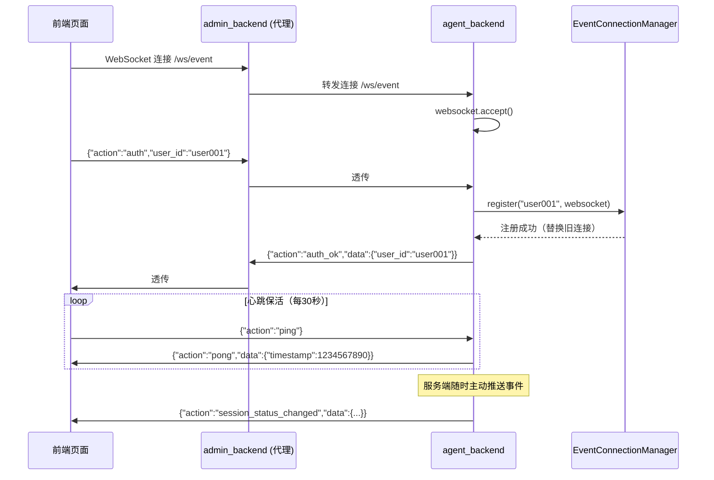
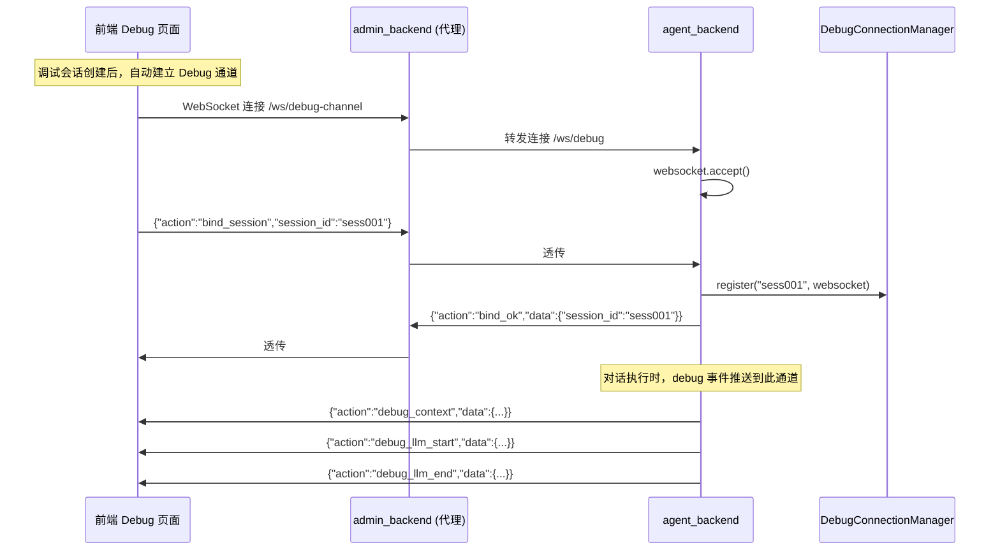
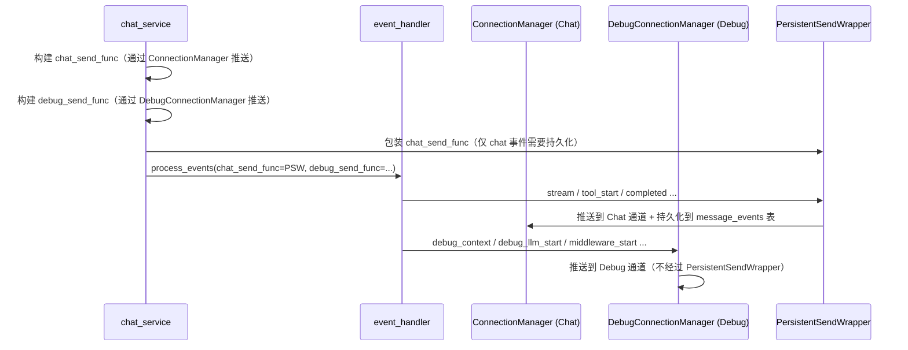
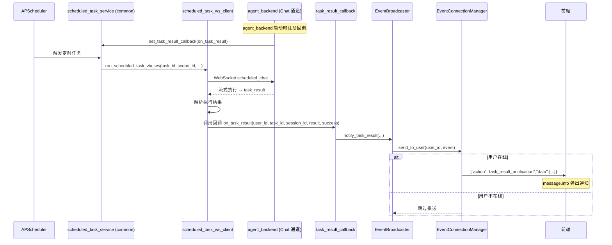
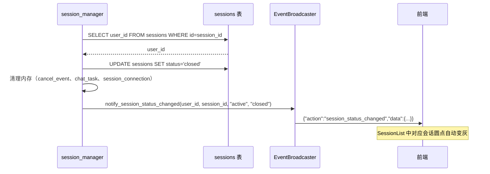

# WebSocket 三通道架构重构 — 需求文档

> 本文档描述 WebSocket 通道架构从单通道到三通道的重构需求，覆盖 Event 通道、Debug 通道、定时任务推送等功能。
> 跨模块交互只标注边界，不定义模块内部实现。

---

## 目录

- [一、文档概述](#一文档概述)
- [二、三通道架构总览](#二三通道架构总览)
- [三、Event 通道 — 页面级实时事件推送](#三event-通道--页面级实时事件推送)
- [四、Debug 通道 — 调试事件独立推送](#四debug-通道--调试事件独立推送)
- [五、Chat 通道 — 对话流式推送（变更说明）](#五chat-通道--对话流式推送变更说明)
- [六、定时任务结果推送](#六定时任务结果推送)
- [七、Session 生命周期调整](#七session-生命周期调整)
- [八、前端页面架构调整](#八前端页面架构调整)
- [九、未来扩展预留](#九未来扩展预留)
- [十、与其他模块的数据边界](#十与其他模块的数据边界)

---

## 一、文档概述

### 1.1 背景与问题

当前系统只有一个 WebSocket 端点 `/ws/ws`（`agent_backend/api/ws_router.py`），所有信息通过同一个通道推送。这带来三个核心问题：

| 问题                    | 说明                                                                                                                            |
|-----------------------|-------------------------------------------------------------------------------------------------------------------------------|
| **场景覆盖不全**            | 定时任务结果通知、会话状态变更等独立事件无法走 Chat 通道推送。Chat 通道是 session 级别的，这些事件需要 user 级别的推送能力                                                    |
| **Chat 与 Debug 事件混杂** | `event_handler.py` 同时处理 chat 流式事件和 debug 专用事件（`debug_context`、`debug_llm_start/end`、`middleware_*`），修改 debug 逻辑会波及 chat 的处理链路 |
| **前端缺乏实时更新**          | Session 列表的状态变更等需要手动刷新，无独立的事件接收通道                                                                                             |

### 1.2 重构范围

本次重构涉及三层改动：

| 层级               | 涉及模块                                                                          | 变更内容                                     |
|------------------|-------------------------------------------------------------------------------|------------------------------------------|
| `agent_backend`  | ws_router、connection 管理、event_handler、chat_service、session_manager | 新增 Event/Debug 两个 WS 端点，拆分事件推送 |
| `admin_backend`  | ws_proxy_router                                                               | 新增两个 WS 代理端点                             |
| `admin_frontend` | debug 页面全部 composable 和组件                                                     | WS 连接管理拆分，Store 拆分，页面状态显示调整              |

### 1.3 不在范围内

| 模块             | 说明                                           |
|----------------|----------------------------------------------|
| Chat 通道协议变更    | `/ws/ws` 端点路径和 action 协议保持不变                 |
| LangSmith 风格监控 | 仅预留扩展方向，本期不实现 trace/span 数据模型                |
| Scene 级状态监控    | 仅预留事件类型，本期不实现聚合统计推送                          |

---

## 二、三通道架构总览

### 2.1 架构设计

将单一 WebSocket 拆分为三个独立通道，各司其职：

```
┌───────────────────────────────────────────────────────────────────────────┐
│                            admin_frontend                                 │
│                                                                           │
│   Event 通道（user 级）     Chat 通道（session 级）    Debug 通道（session 级）│
│   useEventWebSocket        useDebugWebSocket         useDebugChannel      │
└─────────┬──────────────────────────┬──────────────────────────┬───────────┘
          │                          │                          │
          ▼                          ▼                          ▼
┌───────────────────────────────────────────────────────────────────────────┐
│                            admin_backend                                  │
│                                                                           │
│   /ws/event (代理)           /ws/debug (代理，不变)    /ws/debug-channel (代理)│
└─────────┬──────────────────────────┬──────────────────────────┬───────────┘
          │                          │                          │
          ▼                          ▼                          ▼
┌───────────────────────────────────────────────────────────────────────────┐
│                            agent_backend                                  │
│                                                                           │
│   /ws/event                  /ws/ws（不变）              /ws/debug           │
│   EventConnectionManager     ConnectionManager（不变）  DebugConnectionManager│
│   EventBroadcaster（全局单例）                                                │
└───────────────────────────────────────────────────────────────────────────┘
```

### 2.2 通道职责划分

| 维度                    | Event 通道          | Chat 通道             | Debug 通道          |
|-----------------------|-------------------|---------------------|-------------------|
| **连接级别**              | user 级（一个用户一个连接）  | session 级（一个会话一个连接） | session 级（仅调试会话）  |
| **端点路径**              | `/ws/event`（新增）   | `/ws/ws`（不变）        | `/ws/debug`（新增）   |
| **用途**                | 页面级独立事件实时推送       | 对话流式事件推送            | 调试专用事件推送          |
| **连接时机**              | 页面加载且 userId 非空时  | 创建/恢复会话时            | 调试会话创建后           |
| **断开时机**              | 页面关闭              | 关闭会话或页面关闭           | 关闭调试会话或页面关闭       |
| **与 Session 生命周期的关系** | 无关（断连不影响 session） | 绑定（断连触发宽限期）         | 无关（断连不影响 session） |

### 2.3 事件分配总表

#### Event 通道事件

| 事件                         | 说明       | 触发时机                     |
|----------------------------|----------|--------------------------|
| `task_result_notification` | 定时任务结果通知 | 定时任务执行完成                 |
| `session_status_changed`   | 会话状态变更   | session 被关闭（主动/超时/宽限期到期） |
| `system_notice`            | 系统通知（预留） | 服务端主动推送                  |

#### Debug 通道事件

| 事件                       | 说明                                             | 触发时机                       |
|--------------------------|------------------------------------------------|----------------------------|
| `debug_context`          | 调试上下文（system_prompt、model_config、tools、skills） | 首次 LLM 调用前                 |
| `debug_llm_start`        | LLM 调用开始（messages、invocation_params）           | on_chat_model_start        |
| `debug_llm_end`          | LLM 调用结束（response、token_usage）                 | on_chat_model_end          |
| `middleware_start`       | 中间件执行开始                                        | on_chain_start（Middleware） |
| `middleware_end`         | 中间件执行完成                                        | on_chain_end（Middleware）   |
| `middleware_error`       | 中间件执行错误                                        | on_chain_error（Middleware） |
| `memory_recalled`        | 记忆召回                                           | UserProfileMiddleware 完成后  |
| `debug_snapshot_updated` | 快照已更新（通知前端可重新拉取）                               | 每轮对话完成后                    |

#### Chat 通道事件（不变）

保持现有全部事件不变：`stream`、`completed`、`tool_start`、`tool_end`、`subagent_start`、`subagent_end`、`subagent_error`、
`cancelled`、`error`、`session_created`、`session_closed`、`pong`。

---

## 三、Event 通道 — 页面级实时事件推送

### 3.1 定位

Event 通道是 **user 级别** 的 WebSocket 长连接，用于向在线用户推送页面级的独立事件。这些事件不属于任何特定 session
的对话流，而是与用户维度相关的全局通知。

### 3.2 连接端点

**agent_backend 端点**：`ws://host:port/agent-base/ws/event`

**admin_backend 代理端点**：`ws://host:port/master/agent-admin/ws/event`（透传到 agent_backend）

### 3.3 连接协议

#### 客户端 → 服务端

| Action | 说明              | 必传字段      |
|--------|-----------------|-----------|
| `auth` | 身份认证，绑定 user_id | `user_id` |
| `ping` | 心跳保活            | （无）       |

#### 服务端 → 客户端

| Event (action)             | 说明       | data 字段                                              |
|----------------------------|----------|------------------------------------------------------|
| `auth_ok`                  | 认证成功     | `user_id`                                            |
| `pong`                     | 心跳回应     | `timestamp`                                          |
| `task_result_notification` | 定时任务结果通知 | `task_id`, `session_id`, `result_summary`, `success` |
| `session_status_changed`   | 会话状态变更   | `session_id`, `old_status`, `new_status`             |
| `system_notice`            | 系统通知（预留） | `type`, `message`, `level`                           |
| `error`                    | 错误       | `message`                                            |

### 3.4 连接时序



### 3.5 EventConnectionManager

**文件**：`agent_backend/services/event_connection_manager.py`（新建）

Event 通道的连接管理器，user 级别。一个 user_id 最多维护一个连接，重连时自动替换旧连接。

| 方法                                   | 说明                  |
|--------------------------------------|---------------------|
| `register(user_id, websocket)`       | 注册 Event 连接，自动关闭旧连接 |
| `unregister(user_id)`                | 注销 Event 连接         |
| `send_to_user(user_id, data) → bool` | 向指定用户推送事件           |
| `broadcast(data)`                    | 广播给所有在线用户           |
| `is_online(user_id) → bool`          | 检查用户是否在线            |

全局单例：`event_connection_manager = EventConnectionManager()`

### 3.6 EventBroadcaster

**文件**：`agent_backend/services/event_broadcaster.py`（新建）

全局事件广播器，是 Event 通道的**统一推送入口**。任何后端模块需要向用户推送事件时，导入此单例调用对应方法。

```python
from agent_backend.services.event_broadcaster import event_broadcaster

# 使用方式
await event_broadcaster.notify_task_result(user_id, task_id, session_id, result_summary, success)
await event_broadcaster.notify_session_status_changed(user_id, session_id, old_status, new_status)
```

| 方法                                | 调用方                             | 说明                  |
|-----------------------------------|---------------------------------|---------------------|
| `notify_task_result()`            | 定时任务回调                          | 任务执行完成后推送（用户不在线则跳过） |
| `notify_session_status_changed()` | session_manager.close_session() | session 关闭时推送       |

### 3.7 WS 代理

**文件**：`admin_backend/api/ws_proxy_router.py`（修改）

新增 `/ws/event` 代理端点，模式与现有 `/ws/debug` 对称（双向透传）。转发地址从现有 `AGENT_BACKEND_WS_URL` 自动推导（替换路径后缀
`/ws/ws` → `/ws/event`），无需新增配置项。

---

## 四、Debug 通道 — 调试事件独立推送

### 4.1 定位

Debug 通道是 **session 级别** 的 WebSocket 连接，仅在调试会话时建立。将调试事件从 Chat 通道中分离，使 debug 逻辑的修改不再波及
chat 的事件处理链路。

### 4.2 连接端点

**agent_backend 端点**：`ws://host:port/agent-base/ws/debug`

**admin_backend 代理端点**：`ws://host:port/master/agent-admin/ws/debug-channel`（透传到 agent_backend）

> 注意：admin_backend 代理端点命名为 `/ws/debug-channel` 而非 `/ws/debug`，因为 `/ws/debug` 已被现有 Chat 通道代理占用。

### 4.3 连接协议

#### 客户端 → 服务端

| Action         | 说明      | 必传字段         |
|----------------|---------|--------------|
| `bind_session` | 绑定到调试会话 | `session_id` |
| `ping`         | 心跳保活    | （无）          |

#### 服务端 → 客户端

| Event (action)           | 说明       | data 字段                                                                         |
|--------------------------|----------|---------------------------------------------------------------------------------|
| `bind_ok`                | 绑定成功     | `session_id`                                                                    |
| `pong`                   | 心跳回应     | `timestamp`                                                                     |
| `debug_context`          | 调试上下文    | `system_prompt`, `model_config`, `tools`, `skills`, `trace_id`                  |
| `debug_llm_start`        | LLM 调用开始 | `run_id`, `parent_run_id`, `model`, `messages`, `invocation_params`, `trace_id` |
| `debug_llm_end`          | LLM 调用结束 | `run_id`, `response`, `token_usage`, `trace_id`                                 |
| `middleware_start`       | 中间件开始    | `run_id`, `parent_run_id`, `middleware`, `trace_id`                             |
| `middleware_end`         | 中间件结束    | `run_id`, `middleware`, `trace_id`                                              |
| `middleware_error`       | 中间件错误    | `run_id`, `middleware`, `error`, `trace_id`                                     |
| `memory_recalled`        | 记忆召回     | `type`, `content`, `trace_id`                                                   |
| `debug_snapshot_updated` | 快照已更新    | `session_id`                                                                    |
| `error`                  | 错误       | `message`                                                                       |

### 4.4 连接时序



### 4.5 DebugConnectionManager

**文件**：`agent_backend/services/debug_connection_manager.py`（新建）

Debug 通道的连接管理器，session 级别。一个 session_id 最多一个 debug 连接。

| 方法                                         | 说明                |
|--------------------------------------------|-------------------|
| `register(session_id, websocket)`          | 注册 Debug 连接       |
| `unregister(session_id)`                   | 注销 Debug 连接       |
| `send_to_session(session_id, data) → bool` | 向指定调试会话推送事件       |
| `has_debug_connection(session_id) → bool`  | 检查是否有活跃的 debug 连接 |

全局单例：`debug_connection_manager = DebugConnectionManager()`

### 4.6 event_handler 事件分流

**文件**：`agent_backend/engine/event_handler.py`（修改）

核心变更：`process_events()` 接收两个 send_func，按事件类型分流推送。

```python
async def process_events(
        event_stream: AsyncIterator,
        chat_send_func: Callable,  # Chat 通道推送
        debug_send_func: Optional[Callable] = None,  # Debug 通道推送（可选）
        cancel_event=None,
        is_debug=False,
        debug_context=None,
) -> Optional[str]:
```

**分流规则**：

| 事件类型                                                     | 推送目标              | 说明          |
|----------------------------------------------------------|-------------------|-------------|
| `stream`, `completed`, `cancelled`, `error`              | `chat_send_func`  | 对话核心事件      |
| `tool_start`, `tool_end`                                 | `chat_send_func`  | 工具调用事件      |
| `subagent_start`, `subagent_end`, `subagent_error`       | `chat_send_func`  | SubAgent 事件 |
| `debug_context`                                          | `debug_send_func` | 调试上下文       |
| `debug_llm_start`, `debug_llm_end`                       | `debug_send_func` | LLM 调用详情    |
| `middleware_start`, `middleware_end`, `middleware_error` | `debug_send_func` | 中间件事件       |
| `memory_recalled`                                        | `debug_send_func` | 记忆召回        |

**降级处理**：当 `debug_send_func` 为 None 时（非调试模式），debug 事件静默丢弃。调用链数据（`call_chain_nodes`、`llm_calls`
）仍在内存中收集，不影响 `debug_snapshots` 表写入。

### 4.7 chat_service 适配

**文件**：`agent_backend/services/chat_service.py`（修改）

构建两个 send_func 传入 `process_events()`：



**PersistentSendWrapper 清理**：现有的 `SKIP_ACTIONS` 列表中 `debug_*` 和 `middleware_*` 相关项可移除，因为这些事件不再经过
chat_send_func。

### 4.8 WS 代理

**文件**：`admin_backend/api/ws_proxy_router.py`（修改）

新增 `/ws/debug-channel` 代理端点，转发到 agent_backend 的 `/ws/debug`。转发地址从 `AGENT_BACKEND_WS_URL` 推导。

---

## 五、Chat 通道 — 对话流式推送（变更说明）

### 5.1 端点路径不变

Chat 通道端点 `/ws/ws` 保持不变，action 协议不变，现有三方系统和定时任务 WS 客户端无需修改。

### 5.2 事件变更

| 变更    | 说明                                                                                                                                        |
|-------|-------------------------------------------------------------------------------------------------------------------------------------------|
| 移除的事件 | `debug_context`、`debug_llm_start`、`debug_llm_end`、`middleware_start`、`middleware_end`、`middleware_error`、`memory_recalled` 不再通过 Chat 通道推送 |
| 保留的事件 | `stream`、`completed`、`tool_start`、`tool_end`、`subagent_*`、`cancelled`、`error`、`session_created`、`session_closed`、`pong`                   |
| 新增的事件 | 无                                                                                                                                         |

### 5.3 向后兼容性

- 外部调用方（三方系统、定时任务 WS 客户端）不受影响
- 被移除的事件本来就仅在 `is_debug=True` 时推送，非调试模式下无变化
- 调试模式下这些事件改由 Debug 通道推送，前端需要适配

---

## 六、定时任务结果推送

### 6.1 现状

当前定时任务通过内部 WS 客户端（`scheduled_task_ws_client.py`）连接到 `/ws/ws` 执行，结果（`task_result`
事件）只返回给执行器进程，不推送给在线用户。

### 6.2 变更

定时任务执行完成后，通过 EventBroadcaster 向任务创建者推送通知。用户不在线时跳过推送。

### 6.3 实现方式 — 回调解耦

由于 `scheduled_task_ws_client.py` 位于 `common` 模块，而 `EventBroadcaster` 位于 `agent_backend`，通过回调机制解耦：



---

## 七、Session 生命周期调整

### 7.1 保活机制不变

保活机制完全绑定在 Chat 通道上，Event 通道和 Debug 通道的连接/断开不影响 session 生命周期。

| 机制         | 触发条件                                  | 变更                   |
|------------|---------------------------------------|----------------------|
| 保活超时（5min） | Chat 通道 `chat` action 更新 `updated_at` | 不变                   |
| 宽限期（30s）   | **仅** Chat 通道 WebSocket 断连触发          | 不变                   |
| Event 通道断连 | —                                     | 不触发宽限期，不影响任何 session |
| Debug 通道断连 | —                                     | 不触发宽限期，不影响任何 session |

### 7.2 关闭时推送状态变更

**文件**：`agent_backend/services/session_manager.py`（修改）

`close_session()` 中新增 Event 通道通知。需在关闭前先查询 `user_id`（当前实现关闭后无法获取 user_id）。



此逻辑覆盖所有关闭场景：主动关闭、保活超时、宽限期到期、服务重启批量关闭。

---

## 八、前端页面架构调整

### 8.1 WS 连接管理拆分

将现有的单一 `useDebugWebSocket.ts` 拆分为三个独立 composable：

| Composable          | 文件                                 | 操作 | 职责                         |
|---------------------|------------------------------------|----|----------------------------|
| `useEventWebSocket` | `composables/useEventWebSocket.ts` | 新建 | Event 通道连接管理               |
| `useDebugWebSocket` | `composables/useDebugWebSocket.ts` | 重构 | Chat 通道连接管理（移除 debug 事件处理） |
| `useDebugChannel`   | `composables/useDebugChannel.ts`   | 新建 | Debug 通道连接管理               |

### 8.2 Store 拆分

| Store               | 文件                                 | 操作 | 管理的状态                                                              |
|---------------------|------------------------------------|----|--------------------------------------------------------------------|
| `useDebugStore`     | `composables/useDebugStore.ts`     | 重构 | 配置状态、三通道连接状态、会话状态、对话数据（messages、isStreaming 等）                     |
| `useDebugDataStore` | `composables/useDebugDataStore.ts` | 新建 | 调试数据（callChainNodes、llmCalls、recalledMemory、snapshot、debugContext） |
| `useEventStore`     | `composables/useEventStore.ts`     | 新建 | Event 事件处理（更新 sessionList 中的 status、定时任务通知）                        |

### 8.3 连接时机

```
用户进入 Debug 页面
  │
  ├─ 输入 userId（非空） → Event 通道自动连接
  │
  ├─ 点击"连接并创建会话" → Chat 通道连接 → create_session
  │     → session_created 后自动建立 Debug 通道 → bind_session
  │
  ├─ 点击历史会话恢复 → Chat 通道连接（如未连接） → Debug 通道绑定该 session
  │
  ├─ 关闭会话 → Chat 通道关闭 + Debug 通道关闭（Event 通道不受影响）
  │
  └─ 离开页面 → 三个通道全部断开
```

### 8.4 连接状态显示

#### ConfigPanel（左上）

在 header 区域显示 Event 通道和 Chat 通道的连接状态：

```
┌─ 调试配置 ──────────────────────────────────┐
│                                              │
│  Event [●] 已连接     Chat [○] 未连接        │
│                                              │
│  场景: [下拉框]                               │
│  用户ID: [输入框]                             │
│  ...                                         │
│  [连接并创建会话]                              │
└──────────────────────────────────────────────┘
```

状态颜色：绿色 `#52c41a`（connected）、黄色 `#faad14`（connecting）、灰色 `#999`（disconnected）

#### DebugPanel（右侧面板）

在 header 区域显示 Debug 通道的连接状态：

```
┌─ 调试面板 ──────── Debug [●] 已连接 ─────┐
│                                           │
│  [调用链路] [LLM详情] [记忆]               │
│  ...                                      │
└───────────────────────────────────────────┘
```

### 8.5 SessionList 实时更新

当前 SessionList 的会话状态需要手动刷新才能更新。接入 Event 通道后：

| Event 通道事件               | 前端响应                                       |
|--------------------------|--------------------------------------------|
| `session_status_changed` | 更新 `sessionList` 中对应 session 的 `status` 字段 |

**圆点逻辑不变**：

- `current`（当前选中）→ 绿色 `#22c55e`
- `active`（status=active）→ 黄色 `#eab308`
- `closed`（status=closed）→ 灰色 `#d4d4d4`

区别在于状态更新更实时，不再依赖手动刷新。

### 8.6 新增 UI 元素

| 元素           | 位置                  | 触发条件                          | 说明                          |
|--------------|---------------------|-------------------------------|-----------------------------|
| Event 通道断线提示 | 页面顶部 Alert 条        | Event 通道 disconnected         | 黄色可关闭提示："事件通道已断开，部分实时更新不可用" |
| 定时任务通知       | `message.info()` 弹出 | 收到 `task_result_notification` | 显示任务结果摘要                    |

---

## 九、未来扩展预留

### 9.1 LangSmith 风格链路监控（Debug 通道演进方向）

当前调试数据为扁平列表 + `parent_run_id` 关联。后续可演进为 trace 级别链路监控：

| 阶段       | 数据模型                         | Debug 通道变更                |
|----------|------------------------------|---------------------------|
| 第一阶段（本次） | 沿用 `debug_snapshots`（JSON 列） | 拆分通道，事件协议不变               |
| 第二阶段（未来） | 新增 `traces` 表 + `spans` 表    | 事件增加 `trace_id` 字段，协议向前兼容 |

预留数据模型方向：

```
traces 表: id, session_id, trace_id, status, total_tokens, total_duration_ms
spans 表:  id, trace_id, run_id, parent_run_id, span_type(llm/tool/middleware/agent),
           name, status, start_time, end_time, input_data(JSON), output_data(JSON), token_usage(JSON)
```

### 9.2 Scene 级状态监控（Event 通道扩展方向）

Event 通道作为 user 级长连接，天然适合承载应用级聚合数据推送。

预留事件类型（本期不实现）：

| 事件                   | data 字段                                                                    |
|----------------------|----------------------------------------------------------------------------|
| `scene_stats_update` | `scene_id`, `active_sessions`, `total_requests_today`, `avg_response_time` |
| `scene_health_alert` | `scene_id`, `alert_type`, `message`, `severity`                            |
| `llm_quota_warning`  | `scene_id`, `model`, `used_tokens`, `quota_limit`                          |

推送策略：定时轮询（30s）+ 变化推送，通过 `event_connection_manager.broadcast()` 广播。

---

## 十、与其他模块的数据边界

| 本文档模块                               | 依赖的外部模块                             | 交互方式                               |
|-------------------------------------|-------------------------------------|------------------------------------|
| EventBroadcaster.notify_task_result | `scheduled_task_service`            | 通过回调机制接收任务执行结果                     |
| event_handler（分流）                   | `chat_service`                      | 由 chat_service 构建两个 send_func 传入   |
